<!--
## Examples

### Style 1

> This is the example found in the assignment, uses more html

*Table 1: Example component selection*

**External Clock Module**

| **Solution**                                                                                                                                                                                      | **Pros**                                                                                                                                    | **Cons**                                                                                            |
| ------------------------------------------------------------------------------------------------------------------------------------------------------------------------------------------------- | ------------------------------------------------------------------------------------------------------------------------------------------- | --------------------------------------------------------------------------------------------------- |
|  Option 1.  XC1259TR-ND surface mount crystal $1/each [link to product](http://www.digikey.com/product-detail/en/ECS-40.3-S-5PX-TR/XC1259TR-ND/827366)                 | \* Inexpensive[^1] \* Compatible with PSoC \* Meets surface mount constraint of project                                               | \* Requires external components and support circuitry for interface \* Needs special PCB layout. |
|  \* Option 2.  \* CTX936TR-ND surface mount oscillator  \* $1/each  \* [Link to product](http://www.digikey.com/product-detail/en/636L3I001M84320/CTX936TR-ND/2292940) | \* Outputs a square wave  \* Stable over operating temperature   \* Direct interface with PSoC (no external circuitry required) range | * More expensive  \* Slow shipping speed                                                         |

**Choice:** Option 2: CTX936TR-ND surface mount oscillator

**Rationale:** A clock oscillator is easier to work with because it requires no external circuitry in order to interface with the PSoC. This is particularly important because we are not sure of the electrical characteristics of the PCB, which could affect the oscillation of a crystal. While the shipping speed is slow, according to the website if we order this week it will arrive within 3 weeks.

### Style 2

> Also acceptable, more markdown friendly

**External Clock Module**

1. XC1259TR-ND surface mount crystal

    

    * $1/each
    * [link to product](http://www.digikey.com/product-detail/en/ECS-40.3-S-5PX-TR/XC1259TR-ND/827366)

    | Pros                                      | Cons                                                             |
    | ----------------------------------------- | ---------------------------------------------------------------- |
    | Inexpensive                               | Requires external components and support circuitry for interface |
    | Compatible with PSoC                      | Needs special PCB layout.                                        |
    | Meets surface mount constraint of project |

1. CTX936TR-ND surface mount oscillator

    

    * $1/each
    * [Link to product](http://www.digikey.com/product-detail/en/636L3I001M84320/CTX936TR-ND/2292940)

    | Pros                                                              | Cons                |
    | ----------------------------------------------------------------- | ------------------- |
    | Outputs a square wave                                             | More expensive      |
    | Stable over operating temperature                                 | Slow shipping speed |
    | Direct interface with PSoC (no external circuitry required) range |

**Choice:** Option 2: CTX936TR-ND surface mount oscillator

**Rationale:** A clock oscillator is easier to work with because it requires no external circuitry in order to interface with the PSoC. This is particularly important because we are not sure of the electrical characteristics of the PCB, which could affect the oscillation of a crystal. While the shipping speed is slow, according to the website if we order this week it will arrive within 3 weeks.
<!-- 

## <component Name>

1. <ItemName>

    

    * $5.96/each
    * [text](<link>)

    | Pros                                                              | Cons                |
    | ----------------------------------------------------------------- | ------------------- |
    |                                                                   |                     |
    |                                                                   |                     |
    |                                                                   |                     |
    |                                                                   |                     |
    |                                                                   |                     |

1. <ItemName>

    

    * $5.96/each
    * [text](<link>)

    | Pros                                                              | Cons                |
    | ----------------------------------------------------------------- | ------------------- |
    |                                                                   |                     |
    |                                                                   |                     |
    |                                                                   |                     |
    |                                                                   |                     |
    |                                                                   |                     |

1. <ItemName>

    

    * $5.96/each
    * [text](<link>)

    | Pros                                                              | Cons                |
    | ----------------------------------------------------------------- | ------------------- |
    |                                                                   |                     |
    |                                                                   |                     |
    |                                                                   |                     |
    |                                                                   |                     |
    |                                                                   |                     |

**Choice:** Option #:

**Rationale:** 

-->

The purpose of this section is to highlight various solutions for the components used in the subsystem and identify the choices that will best suit this project.

## Components

### External Power Supply

1. USB Power Bank Battery Charger 2A

    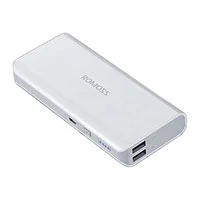{style width:"250" height:"250;"}

    * $39.95/each
    * [*1566*](https://www.digikey.com/en/products/detail/adafruit-industries-llc/1566/6612468?gclsrc=aw.ds&gad_source=1&gad_campaignid=20243136172&gbraid=0AAAAADrbLlhjMd1SI_TeFQt_5_XtjL5xo&gclid=CjwKCAjwr8LHBhBKEiwAy47uUk3q97qpKOk9OI4bVaExirH9Z_ZgJgqjou72gkbAOUQFlqWR2LLEgBoCRz8QAvD_BwE)

    | Pros                                      | Cons                                                             |
    | ----------------------------------------- | ---------------------------------------------------------------- |
    | Outputs 5v which is what most of the components require  | Doesn’t connect to the easily to a barrel jack without an adapter |
    | Square footprint that doesn’t need to be on the pcb just connected | Doesn’t follow the project specifications                 |
    | Could be repurposed or replaced if it breaks easier than other integrated elements | Outputs 1-2A but isn’t clear on how to control the output |

1. BestCH 9V 3.0A AC Adapter

    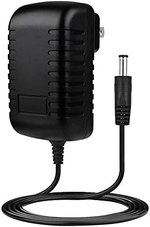{style width:"250" height:"250;"}

    * $4.52/each
    * [*B09ZTKTLGW*](https://a.co/d/hFQdNi4)

    | Pros                                                              | Cons                |
    | ----------------------------------------------------------------- | ------------------- |
    | Outputs the 9V 3A needed for the motor and can be limited down   | Limited to a wall plug |
    | Over charge protection                               | Cord isn’t necessarily long enough |
    | Short circuit protection                             | Barrel jacks have a lot of variability so if it's lost it would be harder to replace |
    | Over current protection                              |Barrel jacks are prone to loosening over time |
    | Consistent voltage output                            |                                  |
    | 100V - 240V Alternating current input                |                                  |
    | Barrel jack can’t be inserted upside down and cause damage to the components |          |
    | Has been tested with other components provided in the class |                           |

1. 6V DC Power Supply 1A Universal AC Adapter

    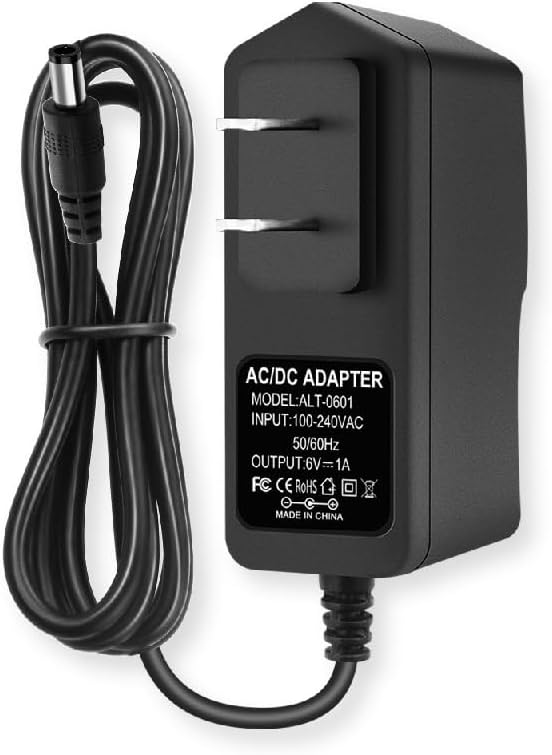{style width:"250" height:"250;"}

    * $5.96/each
    * [*B0B2DWMYYH*](https://a.co/d/5TMpGsm)

    | Pros                                                              | Cons                |
    | ----------------------------------------------------------------- | ------------------- |
    | In between the two required voltages                             | Only 1A output     |
    | 100-240V AC input                                                | Limited to a wall outlet |
    | Consistent output voltage                                        | Small cable which restricts movement |
    |                                                                   | Barrel jacks have a lot of variability so replacement is difficult on the user’s side |
    |                                                                   | Ports are prone to loosening over time with several movements |

**Choice:** Option 2: BestCH 9V 3A AC Adapter

**Rationale:** A barrel jack port works with project specifications and also helps prevent user error while inputting the power supply. The BestCH 9V 3A AC Adapter works the best of the two devices following this form factor. A bonus fact is that the team knows the process to connect it safely to the Micro-controller and various components. This provides ample power for everything within the circuit and doesn't require us to ramp voltage up through another means to power the most voltage intensive elements. The cost being lower than the other two options is a positive but not a critically deciding factor as there are other power supply options that are around the same price point.

### Limit Switch

1. Switch Tactile SPST-NO 0.05A 12V

    {style width:"250" height:"250;"}

    * $0.10/each
    * [*TS02-66-60-BK-160-LCR-D*](https://www.digikey.com/en/products/detail/same-sky-formerly-cui-devices-/TS02-66-60-BK-160-LCR-D/15634268?gclsrc=aw.ds&gad_source=1&gad_campaignid=20243136172&gbraid=0AAAAADrbLlhjMd1SI_TeFQt_5_XtjL5xo&gclid=CjwKCAjwr8LHBhBKEiwAy47uUh-cogwbaGtzIIgXFJdfVBIwK43Z69rQIvC9JF_tBIOo4p1fC_SE3BoCO44QAvD_BwE)

    | Pros                                                              | Cons                                                                 |
    | ----------------------------------------------------------------- | -------------------------------------------------------------------- |
    | Small outline                                                     | Not easily mounted                                                   |
    | Doesn’t require a lot of power                                    | Could require a secondary breadboard area to mount                   |
    | Signals can be in parallel                                        | Small sensing area                                                   |
    |                                                                   | More force than a traditional limit switch                           |
    |                                                                   | Hard to see limit is found                                           |
    |                                                                   | Target surface may move without mechanical support                   |

1. Switch Snap Action SPDT

    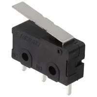{style width:"250" height:"250;"}

    * $1.35/each
    * [*MS0850502F030P1A*](https://www.digikey.com/en/products/detail/e-switch/MS0850502F030P1A/1628122?gclsrc=aw.ds&gad_source=4&gad_campaignid=20243136172&gbraid=0AAAAADrbLlj9VOp3m0S33_Eo5bb054Aan&gclid=CjwKCAjw6P3GBhBVEiwAJPjmLlhCRaDt99omgLz1hzmr-Y8tHiwT0D3Go3Vv2fcdLCyhnChq4JJsNxoCfLgQAvD_BwE)

    | Pros                                                              | Cons                                                                 |
    | ----------------------------------------------------------------- | -------------------------------------------------------------------- |
    | Through hole mounting                                             | Relatively large                                                     |
    | Doesn’t need PCB connection directly (can wire connect)           | Needs support if at the end of actuator range                        |
    | Three states, but only two pins required                          | Acts parallel to placement                                           |
    | 50k+ operation lifespan                                           |                                                                      |
    |                                                                   |                                                                      |

1. Limit Switch SPDT 3A 125V

    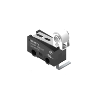{style width:"250" height:"250;"}

    * $4.00/each
    * [*463093691402*](https://www.digikey.com/en/products/detail/w-rth-elektronik/463093691402/14113680?gclsrc=aw.ds&gad_source=1&gad_campaignid=20243136172&gbraid=0AAAAADrbLlhjMd1SI_TeFQt_5_XtjL5xo&gclid=CjwKCAjwr8LHBhBKEiwAy47uUmrm-bK4boEMAm9Mk_cnw0iZMQBKQOZvTpEZI7Jhn9Q0tGQiBCwf3BoC28MQAvD_BwE)

    | Pros                                                              | Cons                                                                 |
    | ----------------------------------------------------------------- | -------------------------------------------------------------------- |
    | Thinner than other options                                        | Bent pin mounts                                                      |
    | Circle likely catches movement better than straight bar           | Pin connection extends past part width                               |
    | Can be mounted away from PCB                                      |                                                                      |
    | Three states, but only two pins required                          |                                                                      |
    | Through hole mounting                                             |                                                                      |

**Choice:** Option 3: Limit Switch SPDT 3A 125V

**Rationale:** This limit switch is rated for the maximum power supply current and for a higher voltage than the project will be using. It's useful in ensuring the motor doesn't go too far and making it so the moisture sensor won't corrode by being in the soil for long periods of time. This particular option is better than the rest due to the smaller size and mounting options. Since it is smaller we won't need as powerful a motor to move the prismatic joint and other components at the end toward the plant. Secondarily, the cylindrical element at the end can create a depression in the soil which will have even more resistance to being moved and will help the actuation of the switch part of the component.

### Motor Driver

1. Brush DC Motor Controller

    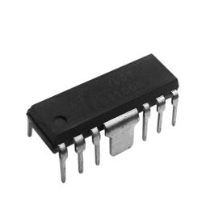{style width:"250" height:"250;"}

    * $0.96/each
    * [*FAN8100N*](https://www.digikey.com/en/products/detail/fairchild-semiconductor/FAN8100N/11558200)

    | Pros                                                              | Cons                                                                 |
    | ----------------------------------------------------------------- | -------------------------------------------------------------------- |
    | Known specs for size, power, and pins                             | Cannot modify pin positions.                                         |
    | Easy-to-replicate footprint                                       | Backup difficult if internal circuit fails.                          |
    | Stands out on PCB canvas                                          | Depends on motor type for it to be effective.                        |
    | Allows for forward and reverse signals                            |                                                                      |
    | Doesn’t need PWM signal                                           |                                                                      |

2. Use a motor that doesn’t need a motor driver

    * Price: N/A
    * This is an option due to the built in ways to manage a motor without a motor driver so we'd be remiss to not at least include the option.

    | Pros                                                              | Cons                                                                 |
    | ----------------------------------------------------------------- | -------------------------------------------------------------------- |
    | Eliminates one component                                          | Forces PWM signals or encoder for control                            |
    | May remove need for a limit switch                                | Requires motor constant tuning                                       |
    | Reduces PCB failure points                                        | May need voltage amplification circuit                               |

3. DRV8874 Single Motor Driver

    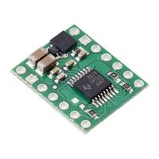{style width:"250" height:"250;"}

    * $11.94/each
    * [*4035*](https://www.digikey.com/en/products/detail/pololu/4035/26714680)

    | Pros                                                              | Cons                                                                 |
    | ----------------------------------------------------------------- | -------------------------------------------------------------------- |
    | Built-in electrical protection =                                  | Breaks project rule: no daughter boards                              |
    | Plug-and-play on breadboard                                       | Needs extra male pin connectors to attach                            |
    | Supports PWM and H-Bridge control                                 |                                                                      |

**Choice:** Option 1: Brush DC Motor Controller

**Rationale:** Even though it adds a component, it follows project specifications and helps ensure the mechanical testing of the motor part. It doesn't hurt that there is a secondary integrated circuit for potential mishaps. Also the unique footprint of the through-hole option helps create an easier design assembly. As an added benefit the team knows how to use this particular component in order to drive a similar motor which will help in testing the overall system. It also removes a limit on the potential motor options and if the motor chosen later doesn't require one then we can change to Option 2. (Spoiler the motor chosen uses this.)

### Voltage Regulator

1. Resistors in series

    {style width:"250" height:"250;"}

    * Price: N/A given unspecified resistor choices
    * [*Potential Resistor Selection kit for reference*](https://a.co/d/aAf8ao3)

    | Pros                                                              | Cons                                                                 |
    | ----------------------------------------------------------------- | -------------------------------------------------------------------- |
    | Can limit voltage                                                 | Voltage output varies with current draw                              |
    | Parallel configuration can alter current                          | Cannot change current and voltage simultaneously                     |
    | Compact placement near PCB face                                   | Requires more space than regulators                                  |
    | Fault-tolerant due to redundancy                                  | Troubleshooting is difficult                                         |

2. Linear Voltage Regulator IC Positive Fixed 1 Output

    {style width:"250" height:"250;"}

    * $0.50/each
    * [*L7805CV*](https://www.digikey.com/en/products/detail/stmicroelectronics/L7805CV/585964)

    | Pros                                                              | Cons                                                                 |
    | ----------------------------------------------------------------- | -------------------------------------------------------------------- |
    | Already provided                                                  | Limited to 1.5A current (some needs are 3A)                          |
    | Well-understood by team                                           | Requires planning for voltage output                                 |
    | Supports additional heat-sinks                                    | Can't automatically adjust input to 5V output                        |
    | Example circuit available                                         |                                                                      |
    | Tested across various circuits                                    |                                                                      |

3. Buck Boost Switching Regulator IC Positive or Negative Adjustable

    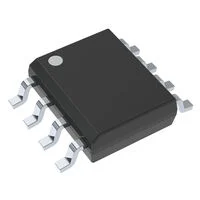{style width:"250" height:"250;"}

    * $0.72/each
    * [*MC34063ADR*](https://www.digikey.com/en/products/detail/texas-instruments/MC34063ADR/717456?gclsrc=aw.ds&gad_source=1&gad_campaignid=20228387720&gbraid=0AAAAADrbLljJJP2LtM7hvCVp3-Mh3_7W_&gclid=CjwKCAjwr8LHBhBKEiwAy47uUqqq2aaMgDxPoCipSHMWYPq1FvuA-GJiQvTwFop36W6WR2qHT0x6vRoC2WUQAvD_BwE)

    | Pros                                                              | Cons                                                                 |
    | ----------------------------------------------------------------- | -------------------------------------------------------------------- |
    | Adjustable output voltage                                         | Max current output is 1.5A                                           |
    | Wide input range (3V–40V)                                         | Currently unfamiliar to team                                         |
    | Design equations provided                                         | Larger footprint than L7805CV                                       |
    | Can be surface or through-hole mounted                            |                                                                      |

**Choice:** Option 2: Linear Voltage Regulator IC Positive Fixed 1 Output

**Rationale:** A linear voltage regulator is a clean solution to help get the power down from a higher voltage and amperage to the voltage we need for parts of this sub-system. In turn this one allows for an additional heat sink attachment if required to help prevent dangerous conditions and enable long-term use. While the price point isn't that much different from a switching regulator the ease of integration into the circuit elevates this option over the others. Also the consistency of this option promotes it over using a line of resistors.

### Barrel Jack

1. Cable Assembly 2.1mm ID, 5.5mm OD Jack to Wire Leads

    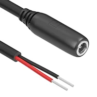{style width:"250" height:"250;"}

    * $3.12/each
    * [*10-02248*](https://www.digikey.com/en/products/detail/tensility-international-corp/10-02248/6412283?gad_source=1&gad_campaignid=20232005509&gbraid=0AAAAADrbLljrcXxUCV1LTsO6jxX4XA7oB&gclid=CjwKCAjwr8LHBhBKEiwAy47uUhWfRJa1WjSa7oFyE4S57edtEmoB1vwpPt2mvGG0NypB_fi1XxlHgBoC86AQAvD_BwE&gclsrc=aw.ds)

    | Pros                                                              | Cons                                                                 |
    | ----------------------------------------------------------------- | -------------------------------------------------------------------- |
    | Matches power supply output port                                  | Amorphous shape makes secure mounting difficult                      |
    | Could be sealed for water resistance                              | Hard to diagnose wire issues                                         |
    | Variable footprint flexibility                                    | Only one ground contact                                              |

2. Power Barrel Connector Jack 2.00mm ID (0.079"), 5.50mm OD (0.217") Through Hole, Right Angle

    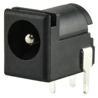{style width:"250" height:"250;"}

    * $0.76/each
    * [*PJ-102AH*](https://www.digikey.com/en/products/detail/cui-devices/PJ-102AH/408448)

    | Pros                                                              | Cons                                                                 |
    | ----------------------------------------------------------------- | -------------------------------------------------------------------- |
    | Stable footprint                                                  | Difficult to waterproof                                              |
    | 3 contacts from 2 conductors                                      | No built-in protection                                               |
    | Through-hole mounted                                              | Pins fragile until PCB-mounted                                       |
    | Matches supply ports                                              |                                                                      |
    | Rated for 24V/5A                                                  |                                                                      |

3. PJ-044BH - butt pins

    {style width:"250" height:"250;"}

    * $5.96/each
    * [*PJ-044BH*](<link>)

    | Pros                                                              | Cons                                                                 |
    | ----------------------------------------------------------------- | -------------------------------------------------------------------- |
    | Pins positioned at rear                                           | Internal exposure if seal is broken                                  |
    | Matches supply output port                                        | No electrical protection                                             |
    | 3 contacts from 2 conductors                                      | Needs firm PCB mounting                                              |
    | Through-hole attachment                                           |                                                                      |
    | Rated for 24V/5A                                                  |                                                                      |

**Choice:** Option 2: Power Barrel Connector Jack 2.00mm ID (0.079"), 5.50mm OD (0.217") Through Hole, Right Angle

**Rationale:** A barrel jack is a good input due to the form factor of the power supply. However, the right angle of the pins allows us to at least create some form of security for the board as well as offer mechanical stability. Otherwise the footprint is distinct which will help in identifying its location on the board. Since it is a hard mechanical component we don't have to worry about it being taken out of the housing or tearing lose from the soldered ends as easily as the amorphous solution. Also due to the pins being perpendicular to the force of the plug being inserted or extracted we know that the solder won't get pulled on its thinnest surface area.

### Motor

1. DC Motor Gearmotor 251 RPM Incremental

    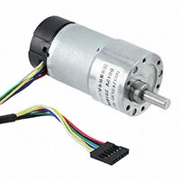{style width:"250" height:"250;"}

    * $16.50/each
    * [*FIT0186*](https://www.digikey.com/en/products/detail/dfrobot/FIT0186/6588528?gad_source=1&gad_campaignid=20243136172&gbraid=0AAAAADrbLlhjMd1SI_TeFQt_5_XtjL5xo&gclid=CjwKCAjwr8LHBhBKEiwAy47uUiZT24D54yJyO7D1VLXUaRgkqtdy2s7iNZbHibsX2ntwZ8JDITamkRoClxUQAvD_BwE&gclsrc=aw.ds)

    | Pros                                                              | Cons                                                                 |
    | ----------------------------------------------------------------- | -------------------------------------------------------------------- |
    | High stall current & Max Operating voltage                        | Requires several control pins                                        |
    | Includes encoder                                                  | Software control needed, not easy to simulate                        |
    | No external software for encoder needed                           | Hard to secure due to cylindrical shape                              |

2. DC Motor Standard 9100 RPM 6VDC

    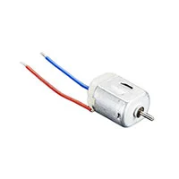{style width:"250" height:"250;"}

    * $1.95/each
    * [*711*](https://www.digikey.com/en/products/detail/adafruit-industries-llc/711/5353610)

    | Pros                                                              | Cons                                                                 |
    | ----------------------------------------------------------------- | -------------------------------------------------------------------- |
    | Works with predefined track                                       | No position feedback                                                 |
    | Flat side helps control torque output                             | Requires external bound control                                      |
    | Compact, easy to secure                                           | Rated 4.5–9V, slightly over 5V limit                                 |
    | Lightweight                                                       | Lower torque                                                         |
    | Mechanically simulative                                           |                                                                      |
    | Flexible mounting options                                         |                                                                      |

3. Positional Rotation DC Motor Servomotor, RC (Hobby) Incremental 4.8VDC

    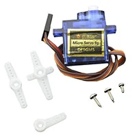{style width:"250" height:"250;"}

    * $3.62/each
    * [*SER0006*](https://www.digikey.com/en/products/detail/dfrobot/SER0006/7597224?gad_source=1&gad_campaignid=20243136172&gbraid=0AAAAADrbLlhjMd1SI_TeFQt_5_XtjL5xo&gclid=CjwKCAjwr8LHBhBKEiwAy47uUvqPSR01UMMaW0vsJkCTgcAjBQFTcxhHIqgslE7rbuC9zgGIagRgSxoCdmYQAvD_BwE&gclsrc=aw.ds)

    | Pros                                                              | Cons                                                                 |
    | ----------------------------------------------------------------- | -------------------------------------------------------------------- |
    | Rectangular shape for better torque transfer                      | Requires homing and configuration                                    |
    | Has incremental encoder                                           | Needs PWM (extra wire)                                               |
    | Rated at 4.8V DC                                                  | Cannot be simulated mechanically                                     |
    | High torque                                                       |                                                                      |
    | No motor controller needed                                        |                                                                      |

**Choice:** Option 2: DC Motor Standard 9100 RPM 6VDC

**Rationale:** While it does have a lowered torque this acts as a safety feature for both the user and the plant in case the moisture sensor is misaligned. Also the flat sides on the housing of the motor allow for a brace to be installed in order to ensure the motor doesn't just spin. An added benefit of not having an encoder is a reduction in the wires that need to be connected directly to the motor. Reducing the amount of wires that would be exposed to the user's environment and needed to be searched to debug errors with the motor. Its size also helps the keep the housing smaller and doesn't force the team to come up with a clever way to hide it or to prevent damage over a larger surface.

### Moisture Sensor

1. Handmade Resistive check using nails

    * Item is not commercially available.

    | Pros                                                              | Cons                                                                 |
    | ----------------------------------------------------------------- | -------------------------------------------------------------------- |
    | No daughter board needed                                          | Materials degrade over time                                          |
    | Easy soil removal                                                 | Readings may be biased by soil chemistry                             |
    | Reading handled in software                                       | Very dry soil might not register                                     |
    | Modular parts for easy repair                                     | Theoretical op-amp dependence unclear                                |

2. Moisture Sensor Evaluation Board

   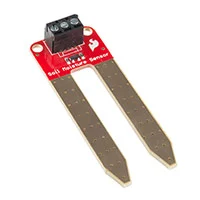{style width:"250" height:"250;"}

   * $7.95/each
   * [*13637*](https://www.digikey.com/en/products/detail/sparkfun-electronics/13637/7400839?gad_source=1&gad_campaignid=20243136172&gbraid=0AAAAADrbLlhjMd1SI_TeFQt_5_XtjL5xo&gclid=CjwKCAjwr8LHBhBKEiwAy47uUjeGi6UtHDL_beVgu_eJiEsKrjFd01ggEMLQVdYcNGciDJtOswrw4hoCn1kQAvD_BwE&gclsrc=aw.ds)

   | Pros                               | Cons                                                   |
   | ---------------------------------- | ------------------------------------------------------ |
   | Easy to extend to probe            | Is a daughter board – violates requirements            |
   | Prebuilt, screw terminals          | Large probes can harm plants                           |
   | Consumer-friendly design potential | Logic integration reduces student learning opportunity |
   | Reaches deeper into soil           |                                                        |

3. VH400 Soil Moisture Sensor

   {style width:"250" height:"250;"}

   * $44.95/each
   * [*VH400*](https://www.vegetronix.com/Products/g/VH400/?gad_source=1&gad_campaignid=16579499448&gbraid=0AAAAAD_hWxYMQJn4Trg0Nl1iOHVlJVMqP&gclid=CjwKCAjwr8LHBhBKEiwAy47uUunZFvPe0wVtp9Pu4kTaTyLGShGn7Eob-b656uyo1-3Cv-Wh-73_LxoCV7MQAvD_BwE)

   | Pros                                    | Cons                                       |
   | --------------------------------------- | ------------------------------------------ |
   | Wide input voltage range                | Likely includes daughter board (violation) |
   | Low current use (<13mA)                 | Probe may not fit pots or harm roots       |
   | Quick sampling (can be toggled on/off)  | Not available from reputable sellers       |
   | Unaffected by salt/fertilizer           |                                            |
   | Usable in hydroponics                   |                                            |
   | Long-lasting corrosion-resistant design |                                            |

**Choice:** Option 1: Handmade resistive check using nails

**Rationale:** This option forces the student team to delve into how electricity is transferred through space. This also follows the project specifications of not having a daughter board component. Unfortunately, for the accuracy due to soil chemistry that is the best option due to majority of moisture sensors needing a daughter board of some kind in order to function.

## Power Budget

After all of our components have been selected we need to ensure that we have enough power to actually complete the subsection as we have designed it. Otherwise, we'll need to find a new or a secondary power source or we'll need to choose different components.

This information can be found at the [*power budget tab*](https://jacobdirks.github.io/05-Power-Budget/Power-Budget/)
