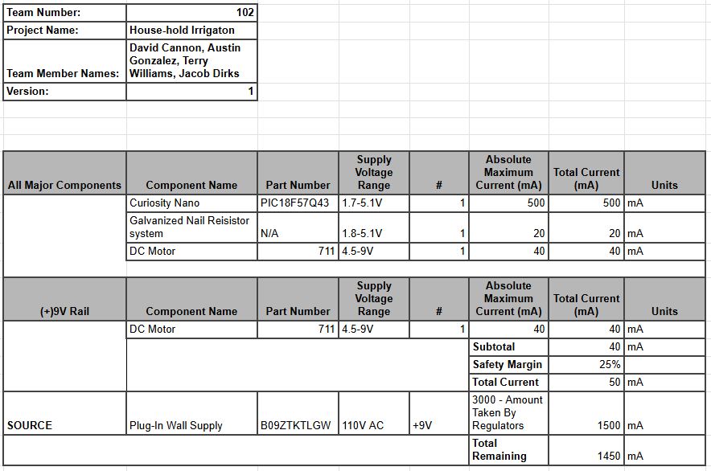

<!-- not yet DONE -->
## Overview

After selecting components in [*Component Selection*](https://jacobdirks.github.io/02-Component-Selection/Component-Selection/) we needed to ensure that the subsection would have the power it needs with the added requirement of a safety margin. Therefore, we took the active components, meaning we excluded switches and passive components, and ensured our power supply as well as our regulators were able to get the power needed. The specifications for each piece came from their datasheet except in the case of the motor where it will only get power through the motor driver so it has different tolerances.

{style width:"350" height:"300;"}

{style width:"350" height:"300;"}

## Conclusions

A single barrel jack port that is delivering 9V and 3A into the system is sufficient for the needs of the subsystem. If needed we have some power left over that we could add some new features after getting client feedback.

## Resources

The power budget is available in other forms such as a [*pdf version*](DirksDocs/powerBudget.pdf), and as a [*Microsoft Excel Sheet*](DirksDocs/PowerBudgetEGR304T102.xlsx).
